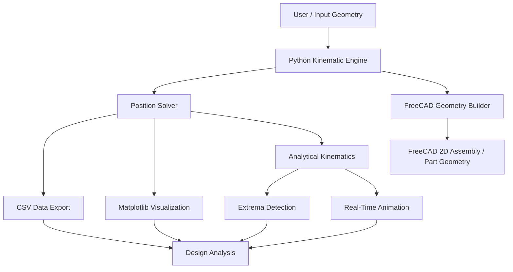
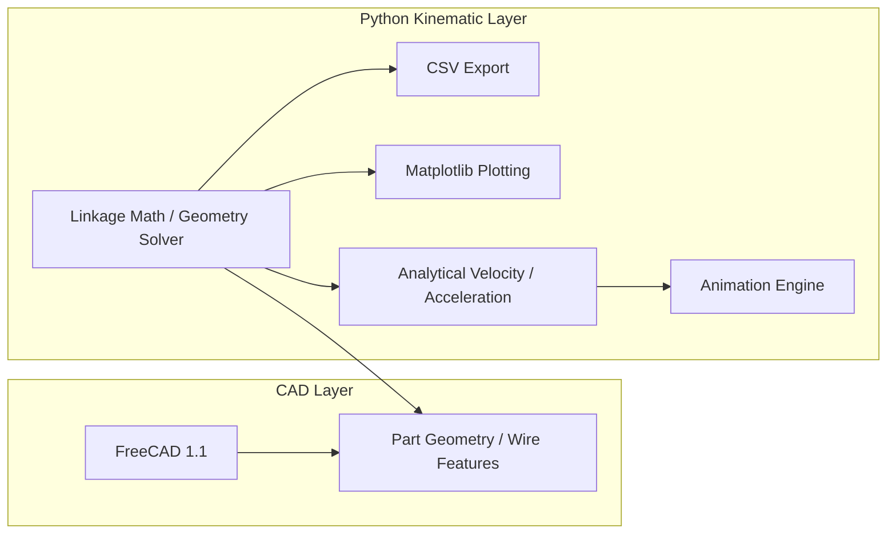
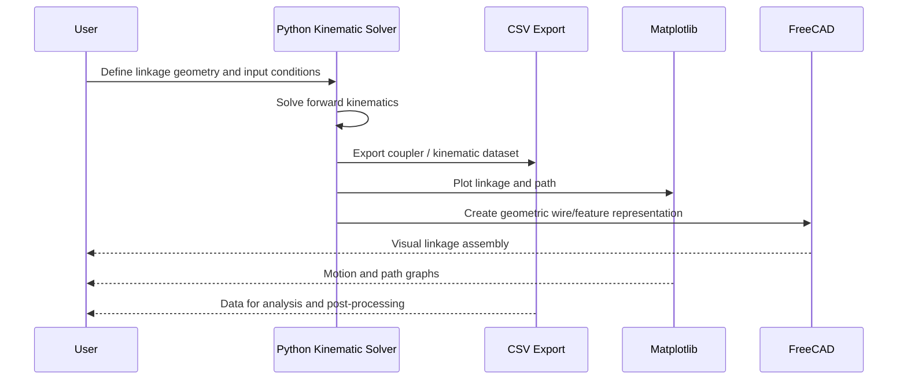

# FreeCAD_As_FK_Engine

## Overview

This project combines two complementary tools:

- FreeCAD is used as the linkage assembly and visualization layer.
- Python is used for planar linkage kinematics, coupler point trajectory generation, analytical evaluation, and animation.

The goal is to model and evaluate 2D/4-bar linkage motion, generate coupler-point paths, export CSV datasets, and visualize the mechanism in a CAD-friendly workflow.

---

## Purpose

The engine is designed to compute linkage motion and coupler-point kinematics for mechanisms such as:

- 2D planar crank-coupler systems
- Four-bar linkage assemblies
- Rigid coupler-point offset calculations
- Coupler path generation for design and validation

This lets a user study the relationship between input crank motion and output coupler geometry using both engineering math and visual CAD output.

---

## System Architecture

### High-Level Architecture



### Functional Layering



---

## Project Structure

```text
FreeCAD_As_FK_Engine/
├── FK_FreeCAD_README.md
├── main.py
├── requirements.txt
├── Data/
├── Data_Local/
├── Project_Docs/
├── Scripts/
├── Src/
│   ├── 2d_planar_fk_engine_with_csv_export.py
│   ├── 2d_planar_fk_engine_with_matplotlib_visualization.py
│   ├── 4_bar_analytical_kinematics_extrema_engine.py
│   └── 4_bar_kinematics_with_real_time_animation.py
└── Tests/
```

---

## Module Summary

### 1) 2d_planar_fk_engine_with_csv_export.py

Purpose:
- Implements a basic 2D planar linkage model.
- Solves forward kinematics for a crank and coupler geometry.
- Exports coupler trajectory points to CSV.
- Builds a simple final-frame mechanism wire in FreeCAD.

Responsibilities:
- Define a planar mechanism class
- Compute pivot and coupler coordinates from input angles
- Sweep the crank over a full rotation
- Save trajectory data to a CSV file
- Generate a FreeCAD document from the final geometry

Typical output:
- coupler_trajectory.csv
- 2D mechanism geometry in FreeCAD

---

### 2) 2d_planar_fk_engine_with_matplotlib_visualization.py

Purpose:
- Extends the 2D kinematics logic into a visualization workflow.
- Produces a Matplotlib plot of the four-bar linkage and coupler path.
- Helps interpret the motion without relying solely on CAD output.

Responsibilities:
- Solve linkage positions from crank angle
- Evaluate coupler point path
- Plot the mechanism skeleton and trajectory
- Generate a visual representation of the coupler curve

Typical output:
- Matplotlib plot window
- graphical inspection of linkage motion

---

### 3) 4_bar_analytical_kinematics_extrema_engine.py

Purpose:
- Performs analytical four-bar linkage kinematics.
- Computes position, velocity, and acceleration data for the coupler point.
- Identifies extrema values such as maximum velocity, minimum velocity, maximum acceleration, and zero-crossings in tangential acceleration.

Responsibilities:
- Solve the closed-loop four-bar mechanism geometry
- Use Jacobian-based velocity and acceleration calculations
- Export motion datasets with analytical metrics
- Detect kinematic extrema for design insight

Typical output:
- fourbar_kinematic_data.csv
- analytics for critical motion states

---

### 4) 4_bar_kinematics_with_real_time_animation.py

Purpose:
- Builds a real-time animated visualization of the four-bar mechanism.
- Combines analytical kinematic solving with animated rendering.
- Shows the moving linkage and the coupler-point trajectory as the mechanism evolves.

Responsibilities:
- Compute motion states over time
- Track the coupler point path
- Animate crank, coupler, and rocker motion
- Mark peak velocity and acceleration states
- Present a dynamic mechanism visualization

Typical output:
- live animation window
- real-time linkage state playback

---

## Data Flow



---

## Design Logic

The project follows a consistent engineering workflow:

1. Define linkage dimensions and joint geometry.
2. Solve planar position relationships using trigonometry and closed-loop equations.
3. Compute coupler point coordinates and rigid-body offsets.
4. Export numeric data to CSV for analysis and documentation.
5. Plot or animate the mechanism in Python.
6. Build a corresponding FreeCAD representation for CAD-based inspection.

This creates a bridge between:

- analytical engineering calculations
- graphical motion interpretation
- CAD-based assembly validation

---

## Why FreeCAD + Python?

This project uses FreeCAD to represent the mechanical assembly in a 3D CAD environment while Python handles the numerical work.

Benefits:
- Real geometric assembly context
- Visualization of linkage shape and path
- Easy data export for analysis
- Kinematic computation in a scriptable engineering workflow

In short:

- FreeCAD = geometry and assembly handling
- Python = motion solving, plotting, analytics, and animation

---

## Typical Use Cases

- Study coupler path geometry for a four-bar linkage
- Evaluate how a coupler point moves as the crank rotates
- Compare different linkage dimensions and offsets
- Export trajectory data for design review or optimization
- Visualize mechanism operation before physical prototyping

---

## Notes

- This project is intended for a Windows-based workflow with FreeCAD 1.1 installed.
- FreeCAD DLL path configuration is required for the Python scripts to import the CAD API correctly.
- The scripts are designed to work with link dimensions in millimeters and angular values in degrees unless otherwise specified.

---

## Summary

The FreeCAD_As_FK_Engine project is a compact linkage kinematics toolkit that combines CAD assembly with engineering computation. It uses a modular script structure to separate:

- 2D planar position solving
- CSV export
- Matplotlib visualization
- analytical extrema analysis
- real-time animation
- FreeCAD geometry creation

This modular design makes the project easy to extend for more complicated mechanisms, optimization studies, or CAD-based validation workflows.
