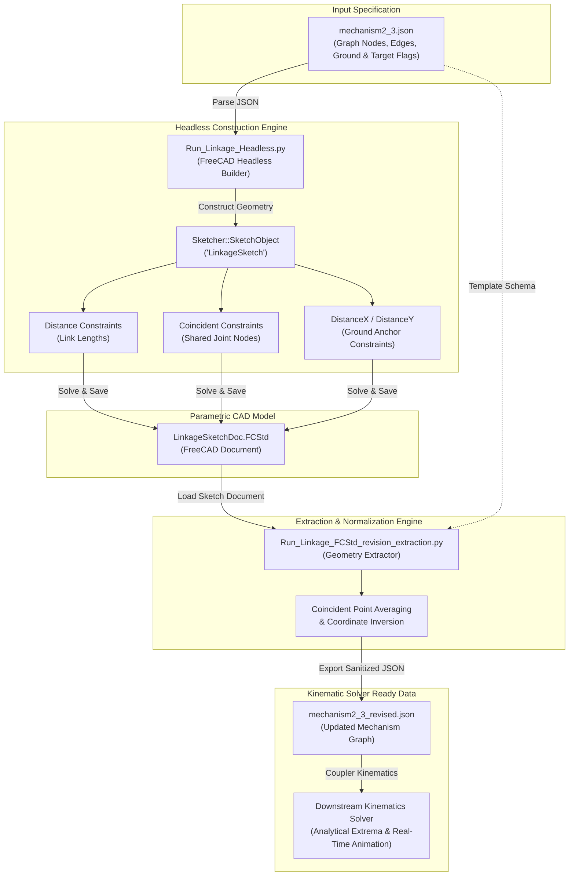
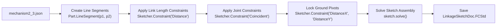
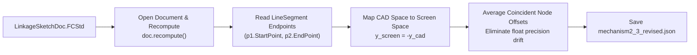

# FreeCAD_As_FK_Engine: FreeCAD Python Console & Headless Pipeline

A bidirectional integration pipeline between FreeCAD's geometric constraint solver and Python-based forward kinematics engines. This module converts raw JSON mechanism graph definitions into parametric FreeCAD `.FCStd` sketch models and extracts recomputed/modified sketch vertex coordinates back into clean JSON format for downstream kinematic and coupler curve solvers.

---

## Purpose

The primary objectives of this module are:

- **Assembly & Constraint Solving**: Leverage FreeCAD's C++ Sketcher constraint engine to construct, assemble, and solve planar multi-link mechanisms headlessly or via the FreeCAD Python Console.
- **JSON to CAD Bidirectional Bridge**:
  - Ingest planar mechanism topology and nodal coordinates from [FreeCAD_Python_Console_Holder/mechanism2_3.json](FreeCAD_Python_Console_Holder/mechanism2_3.json).
  - Generate a fully constrained parametric FreeCAD model saved to [FreeCAD_Python_Console_Holder/LinkageSketchDoc.FCStd](FreeCAD_Python_Console_Holder/LinkageSketchDoc.FCStd).
  - Extract updated geometric states from [FreeCAD_Python_Console_Holder/LinkageSketchDoc.FCStd](FreeCAD_Python_Console_Holder/LinkageSketchDoc.FCStd) after sketch recomputation or manual manipulation.
  - Output structured, sanitized coordinates to [FreeCAD_Python_Console_Holder/mechanism2_3_revised.json](FreeCAD_Python_Console_Holder/mechanism2_3_revised.json) for analytical kinematics and animation engines.

---

## Architecture Diagrams

### 1. System Architecture & Bidirectional Data Flow



---

### 2. Assembly & Constraint Pipeline



---

### 3. Coordinate Transformation & Extraction Pipeline



---

## Highlighted Modules & Files

| File | Type | Description |
| :--- | :--- | :--- |
| [FreeCAD_Python_Console_Holder/Run_Linkage_Headless.py](FreeCAD_Python_Console_Holder/Run_Linkage_Headless.py) | Python Script | Reads JSON topology, dynamically configures FreeCAD C++ binary paths, initializes a `Sketcher::SketchObject`, applies distance/coincident/ground constraints, solves mechanism assembly degrees of freedom, and exports the `.FCStd` document. |
| [FreeCAD_Python_Console_Holder/Run_Linkage_FCStd_revision_extraction.py](FreeCAD_Python_Console_Holder/Run_Linkage_FCStd_revision_extraction.py) | Python Script | Inspects an existing `.FCStd` document, iterates through solved `Part.LineSegment` elements, extracts vertex coordinates, converts CAD coordinates back to screen space, eliminates coincident drift via averaging, and updates the JSON schema. |
| [FreeCAD_Python_Console_Holder/mechanism2_3.json](FreeCAD_Python_Console_Holder/mechanism2_3.json) | JSON Dataset | Initial input definition containing mechanism nodal coordinates, ground identifiers (`isGround`), kinematic target points (`isTarget`), and connectivity edges with motor flags (`isMotor`). |
| [FreeCAD_Python_Console_Holder/mechanism2_3_revised.json](FreeCAD_Python_Console_Holder/mechanism2_3_revised.json) | JSON Dataset | Extracted and normalized mechanism representation containing recomputed coordinate states ready for multi-link analytical solvers and kinematic engines. |
| [FreeCAD_Python_Console_Holder/LinkageSketchDoc.FCStd](FreeCAD_Python_Console_Holder/LinkageSketchDoc.FCStd) | FreeCAD CAD File | Native FreeCAD project file holding the fully constrained 2D sketch (`LinkageSketch`) for inspection, visual constraint validation, and graphical manipulation in the FreeCAD GUI. |

---

## Coordinate Space Mapping

The pipeline reconciles coordinate discrepancies between 2D screen/image conventions and standard 3D CAD Cartesian conventions:

- **FreeCAD CAD Space**: Positive $Y$ axis points upward ($+Y_{CAD}$).
- **Screen / JSON Space**: Positive $Y$ axis points downward ($+Y_{Screen}$).

$$x_{CAD} = x_{Screen}, \quad y_{CAD} = -y_{Screen}$$

$$x_{Screen} = x_{CAD}, \quad y_{Screen} = -y_{CAD}$$

When extracting joint locations in [FreeCAD_Python_Console_Holder/Run_Linkage_FCStd_revision_extraction.py](FreeCAD_Python_Console_Holder/Run_Linkage_FCStd_revision_extraction.py), coincident vertices are averaged across all incident links to prevent numerical solver drift:

$$\bar{x}_n = \frac{1}{K} \sum_{k=1}^{K} x_{n,k}, \quad \bar{y}_n = \frac{1}{K} \sum_{k=1}^{K} (-y_{n,k})$$

---

## Execution Instructions

### 1. Generate FreeCAD Model from JSON

Execute [FreeCAD_Python_Console_Holder/Run_Linkage_Headless.py](FreeCAD_Python_Console_Holder/Run_Linkage_Headless.py) to build and solve the sketch:

```powershell
python FreeCAD_Python_Console_Holder/Run_Linkage_Headless.py
```

### 2. Extract Revised Coordinates from FreeCAD Model to JSON

Execute [FreeCAD_Python_Console_Holder/Run_Linkage_FCStd_revision_extraction.py](FreeCAD_Python_Console_Holder/Run_Linkage_FCStd_revision_extraction.py) to extract the recomputed geometry:

```powershell
python FreeCAD_Python_Console_Holder/Run_Linkage_FCStd_revision_extraction.py
```
