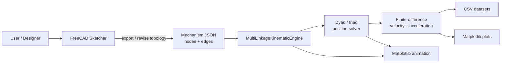
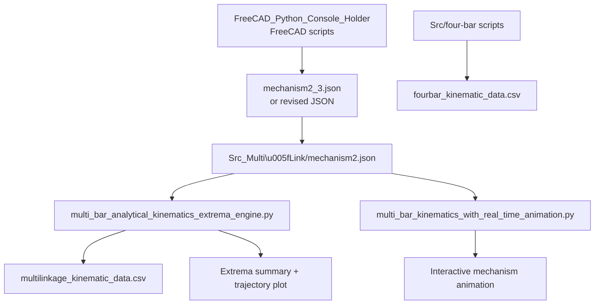
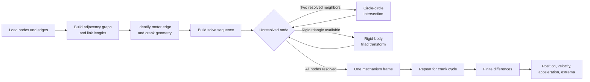

# FreeCAD_As_FK_Engine For Multi-Link Mechanism
* This effort was generalizing linkages beyond the basic four bar

A hybrid FreeCAD and Python project for building linkage assemblies, solving planar coupler-point kinematics, and inspecting motion through plots, animation, and CSV exports.

## Purpose

The repository connects two complementary workflows:

- **FreeCAD** describes and edits the linkage assembly as a constrained sketch.
- **Python** reads a JSON mechanism graph, solves the mechanism through a full crank cycle, and calculates coupler position, velocity, and acceleration.

The current multi-link example is a generalized 1-DOF planar mechanism with ground nodes, a motor edge, a target node, and dyad/triad constraints.

## Architecture

### System architecture



### Repository data flow



### Kinematic solve pipeline



## Highlighted multi-link files

All files below are in [`Src_Multi_Link`](Src_Multi_Link/).

| File | Role |
| --- | --- |
| [`multi_bar_analytical_kinematics_extrema_engine.py`](Src_Multi_Link/multi_bar_analytical_kinematics_extrema_engine.py) | Main analytical solver. Loads the mechanism graph, builds a dynamic dyad/triad solve sequence, computes a 720-step cycle, extracts velocity and acceleration extrema, and exports the multi-link CSV. |
| [`multi_bar_kinematics_with_real_time_animation.py`](Src_Multi_Link/multi_bar_kinematics_with_real_time_animation.py) | Interactive visualization. Solves 360 crank-angle frames and animates links, node labels, ground pivots, target node, and node trajectories. |
| [`mechanism2.json`](Src_Multi_Link/mechanism2.json) | Input mechanism definition. Stores node coordinates, ground/target flags, graph edges, and the motor edge. |
| [`multilinkage_kinematic_data.csv`](Src_Multi_Link/multilinkage_kinematic_data.csv) | Output dataset from the generalized multi-link solver: crank angle, target position, velocity components/magnitude, and acceleration components/magnitude. |
| [`fourbar_kinematic_data.csv`](Src_Multi_Link/fourbar_kinematic_data.csv) | Four-bar reference dataset containing the analytical four-bar configuration and motion parameters. |

## Input model

`mechanism2.json` has two top-level collections:

- `nodes`: `{id, x, y, isGround, isTarget}` records.
- `edges`: `{nodeIds, isMotor}` records connecting node IDs.

The solver derives link lengths from the node coordinates. It identifies the edge with `isMotor: true`, treats its ground endpoint as the crank ground, and uses the node marked `isTarget` for kinematic derivatives and exports.

Coordinates are processed as planar coordinates. The plotting code inverts the Y axis to match the image/sketch convention used by the project.

## Python workflow

Install the numerical and plotting dependencies in the project environment. The analytical scripts use NumPy and Matplotlib.

Run the analytical extrema workflow from the multi-link directory so its relative JSON and CSV paths resolve correctly:

```powershell
Set-Location .\Src_Multi_Link
python .\multi_bar_analytical_kinematics_extrema_engine.py
```

This workflow:

1. Loads `mechanism2.json`.
2. Solves 720 positions across 360 degrees at `omega1 = 10.0` rad/s.
3. Uses numerical finite differences for velocity and acceleration.
4. Finds maximum/minimum velocity and acceleration and zero tangential-acceleration locations.
5. Rewrites `multilinkage_kinematic_data.csv`.
6. Displays the trajectory and extrema plot.

Run the real-time animation with:

```powershell
Set-Location .\Src_Multi_Link
python .\multi_bar_kinematics_with_real_time_animation.py
```

The animation uses the previous frame to select the closest circle-intersection branch, which helps preserve continuous motion between frames.

## FreeCAD workflow

The FreeCAD helper scripts are in [`FreeCAD_Python_Console_Holder`](FreeCAD_Python_Console_Holder/). They are intended to run with FreeCAD's Python environment because they import `FreeCAD`, `Part`, and `Sketcher`.

Relevant scripts include:

- [`Run_Linkage_Headless.py`](FreeCAD_Python_Console_Holder/Run_Linkage_Headless.py): reads a linkage JSON file, creates line geometry and constraints in a FreeCAD sketch, solves the assembly, and saves `LinkageSketchDoc.FCStd`.
- [`Directory_Set.py`](FreeCAD_Python_Console_Holder/Directory_Set.py): builds a sketch from JSON and exports a revised mechanism JSON from the sketch geometry.

The FreeCAD side uses the same conceptual graph as the Python solver: nodes become shared sketch vertices and edges become line segments. Ground nodes are constrained, while the resulting JSON is the interchange format for the analytical solver.

## Output columns

`multilinkage_kinematic_data.csv` contains:

- `crank_angle_deg`
- `target_p_x`, `target_p_y`
- `vel_x`, `vel_y`, `vel_mag`
- `acc_x`, `acc_y`, `acc_mag`
- `acc_tangential`, `acc_normal`

The current example uses pixel-like coordinates from the FreeCAD-derived input. Treat the output units as coordinate-units per second and coordinate-units per second squared unless the input coordinates have been calibrated to a physical unit.

## Project layout

```text
FreeCAD_As_FK_Engine/
├── FreeCAD_Python_Console_Holder/  FreeCAD import/export and headless helpers
├── Project_Docs/                   Setup and project notes
├── Src/                            Four-bar and smaller FK examples
├── Src_Multi_Link/                 Generalized multi-link solver and datasets
├── Tests/                          Test area
├── main.py                         Project entry point, if used by the local workflow
├── pyproject.toml                  Python project metadata
└── requirements.txt                Additional environment requirements
```

## Notes and limitations

- The generalized solver expects a resolvable 1-DOF topology. It raises an error when no dyad or triad step can resolve the remaining nodes.
- A circle-intersection failure is reported as a kinematic lockup for that crank angle.
- The current scripts use a fixed input angular speed of `10.0` rad/s unless changed in the script.
- The analytical derivatives are numerical finite differences over the sampled cycle; increase the number of steps when higher angular resolution is needed.
- FreeCAD imports should be run with a compatible FreeCAD Python installation, while the numerical scripts should use the project virtual environment to avoid package conflicts.
